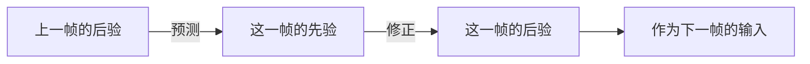
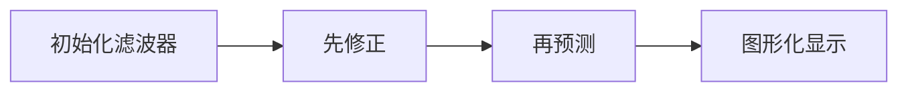

# kalman filter 学习
## 1.直观解释

### 1.1 为什么要滤波? 
因为传感器等数据观测者会存在观测偏差与精度缺失,或是信号传输中产生噪声.

### 1.2 滤波的方式?
相当于根据样本值的分布,进行实际值的拟合.

### 1.3 滤波和预测的关系?
按照当前的拟合趋势,提前判断下一个点的位置,就实现了预测的功能.

## 2.原理介绍
核心思想是`贝叶斯滤波`,外加一些矩阵的基本操作.
###  2.1 核心思想
将当前运动状态视为一个`正态分布`$f_k - N(u_k,\sigma_k)$
###  2.2 核心模型
$$运动模型 : X_k = f_{k-1}(X_{k-1})+Q_k$$
$$观测模型:  Y_k=h(X_k)+R_k$$
其中
$k$代表当前时间戳,
$X_{k-1}$代表第$k-1$次的状态向量,
$f_k$表示运动模型函数,$h$表示观测模型函数(本质是多项式的系数)

这是一个递推过程.

###  2.3 核心步骤
预测就是要确定下一时刻的目标概率分布,即确定相应的$u_k$期望与$\sigma_k$方差
通过以下五个式子实现预测与更新:
①$u_k^-=F*u_{k-1}^+$
②$\sigma_k^-=F*\sigma_{k-1}^+*F^T + Q_k$
③$K = \sigma_k^- *H^T*(H* \sigma_k^- *H^T+R_k)^{-1}$
④$u_k^+=u_{k}^-+K(y_k - H*u_k^-)$
⑤$\sigma_k^+=(I-K*H)*\sigma_{k}^-$
其中上下标+-表示当前轮状态的后验概率与先验概率.
$F$运动模型矩阵,反应了运动函数多项式的系数
$H$观测模型矩阵,是用于状态向量向观测值转变的矩阵
$K$为卡尔曼增益,就是推导过程中的④与⑤式子的共同变量.
###  2.4 工作流程

###  2.5 参考资料
> 具体推导过程就不说了,这里给出一些参考资料:
> 哔站最强kalman推导(从贝叶斯滤波开始):https://space.bilibili.com/287989852/
> 相应的推导博客:https://blog.csdn.net/wq1psa78/article/details/105849353
>油管最强kalman通俗演讲: https://www.youtube.com/watch?v=CaCcOwJPytQ&list=PLX2gX-ftPVXU3oUFNATxGXY90AULiqnWT
>一个例子搞清楚（先验分布/后验分布/似然估计 : https://blog.csdn.net/qq_23947237/article/details/78265026
>
## 3.代码使用
主体kalman操作函数借用了opencv自带`kalman.cpp`
### 3.1 源代码
```cpp
class CV_EXPORTS_W KalmanFilter{
public:
    CV_WRAP KalmanFilter();
    CV_WRAP KalmanFilter( int dynamParams, int measureParams, int controlParams = 0, int type = CV_32F );
    /** @brief Re-initializes Kalman filter. The previous content is destroyed.
    @param dynamParams Dimensionality of the state.
    @param measureParams Dimensionality of the measurement.
    @param controlParams Dimensionality of the control vector.
    @param type Type of the created matrices that should be CV_32F or CV_64F.
     */
    void init( int dynamParams, int measureParams, int controlParams = 0, int type = CV_32F );
    /** @brief Computes a predicted state.
    @param control The optional input control
     */
    CV_WRAP const Mat& predict( const Mat& control = Mat() );

    /** @brief Updates the predicted state from the measurement.
    	@param measurement The measured system parameters
     */
    CV_WRAP const Mat& correct( const Mat& measurement );

    CV_PROP_RW Mat statePre;           //!< predicted state (x'(k)): x(k)=A*x(k-1)+B*u(k)
    CV_PROP_RW Mat statePost;          //!< corrected state (x(k)): x(k)=x'(k)+K(k)*(z(k)-H*x'(k))
    
    CV_PROP_RW Mat transitionMatrix;   //!< state transition matrix (A)
    CV_PROP_RW Mat controlMatrix;      //!< control matrix (B) (not used if there is no control)
    CV_PROP_RW Mat measurementMatrix;  //!< measurement matrix (H)
    
    CV_PROP_RW Mat processNoiseCov;    //!< process noise covariance matrix (Q)
    CV_PROP_RW Mat measurementNoiseCov;//!< measurement noise covariance matrix (R)
    CV_PROP_RW Mat errorCovPre;        //!< priori error estimate covariance matrix (P'(k)): P'(k)=A*P(k-1)*At + Q)*/
    
    CV_PROP_RW Mat gain;               //!< Kalman gain matrix (K(k)): K(k)=P'(k)*Ht*inv(H*P'(k)*Ht+R)
    CV_PROP_RW Mat errorCovPost;       //!< posteriori error estimate covariance matrix (P(k)): P(k)=(I-K(k)*H)*P'(k)
};
```
其中

`CV_PROP_RW Mat statePre;`是先验状态,代表$X_k^-$
`CV_PROP_RW Mat statePost`是后验状态,代表$X_k^+$
`CV_PROP_RW Mat transitionMatrix`是状态转移矩阵,代表$F$
`CV_PROP_RW Mat measurementMatrix`是观测模型矩阵,代表$H$
`CV_PROP_RW Mat processNoiseCov`,`CV_PROP_RW Mat measurementNoiseCov`是噪音,代表$R$和$Q$
`CV_PROP_RW Mat gain`是卡尔曼增益,代表$K$

### 3.2 使用流程

#### 3.2.1 初始化
初始化状态向量和测量向量:确定维度,及初始化这两个向量
```cpp
        KF.init(stateSize, measSize, contrSize, CV_32F);
        state=cv::Mat(stateSize, 1, CV_32F);
        measure=cv::Mat(measSize, 1, CV_32F);
```
初始化状态转移矩阵与观测矩阵:
```cpp
            KF.transitionMatrix = (Mat_<float>(stateSize,stateSize) <<
                    1,0,0,0,1,0,0,0,1,0,
                    0,1,0,0,0,1,0,0,0,1,
                    0,0,1,0,0,0,1,0,0,0,
                    0,0,0,1,0,0,0,1,0,0,
                    0,0,0,0,1,0,0,0,0,0,
                    0,0,0,0,0,1,0,0,0,0,
                    0,0,0,0,0,0,1,0,0,0,
                    0,0,0,0,0,0,0,1,0,0,
                    0,0,0,0,0,0,0,0,1,0,
                    0,0,0,0,0,0,0,0,0,1
                    );

            KF.measurementMatrix  = (Mat_<float>(measSize,stateSize,CV_32F)<<
                    1,0,0,0,0,0,0,0,0,0,
                    0,1,0,0,0,0,0,0,0,0,
                    0,0,1,0,0,0,0,0,0,0,
                    0,0,0,1,0,0,0,0,0,0
            );
```
设置噪音:

```cpp
        /**设对角线为scalar的噪音*/
        setIdentity(KF.processNoiseCov, Scalar::all(1e-5));
        setIdentity(KF.measurementNoiseCov, Scalar::all(1e-1));
        setIdentity(KF.errorCovPost, Scalar::all(1));
```

#### 3.2.2 修正
确定时间$dT$

```cpp
float deltaT = (timeStamp - m_lastTimeStamp) /1000;
```
更新状态转移矩阵

```cpp
KF.transitionMatrix = (cv::Mat_<float>(stateSize,stateSize)
                    <<
                    1,0,0,0,deltaT,0     ,0     ,0     ,deltaT*deltaT/2,0              ,
                    0,1,0,0,0     ,deltaT,0     ,0     ,0              ,deltaT*deltaT/2,
                    0,0,1,0,0     ,0     ,deltaT,0     ,0,0,
                    0,0,0,1,0     ,0     ,0     ,deltaT,0,0,
                    0,0,0,0,1     ,0     ,0     ,0     ,0,0,
                    0,0,0,0,0     ,1     ,0     ,0     ,0,0,
                    0,0,0,0,0     ,0     ,1     ,0     ,0,0,
                    0,0,0,0,0     ,0     ,0     ,1     ,0,0,
                    0,0,0,0,0     ,0,0,0,1,0,
                    0,0,0,0,0     ,0,0,0,0,1
            );
```
载入观测值,进行修正

```cpp
        measure= (Mat_<float>(measSize,1) <<bBox.x,bBox.y,bBox.width,bBox.height);
        KF.correct(measure);
```

#### 3.2.3 预测

```cpp
state = KF.predict();
```

#### 3.2.4 图形化显示
黄色为上一帧的位置,绿色为实际(观测值)位置,红色为预测位置.

```cpp
        /**获取预测位置,[x,y,w,h] 左上点坐标 宽 高*/
        cv::Mat& state = kalman_filter.state;
        /**预测位置偏差太大,筛选不要*/
        if(abs(state.at<float>(0)-faces[i].x)>faces[i].x){
            continue;
        }
        /**用于打印预测框 @红色red*/
        cv::Rect predRect;
        predRect.width = state.at<float>(2);
        predRect.height = state.at<float>(3);

        cv::Point center;
        center.x = state.at<float>(0)+predRect.width / 2;
        center.y = state.at<float>(1)+predRect.height / 2;

        predRect.x = state.at<float>(0);
        predRect.y = state.at<float>(1);

        cv::circle(frame, center, 2, CV_RGB(255,0,0), -1);
        cv::rectangle(frame, predRect, CV_RGB(255,0,0), 2);
        /**评估预测误差,直接采用差的平方和*/
        Mat predict_box = state(Range(0,4),Range(0,1)).clone().t();
        Mat Real_box = (Mat_<float >(1,4)<<faces[i].x,faces[i].y,faces[i].width,faces[i].height);
        cout<<"|predict_box : "<<predict_box<<endl;
        cout<<"|Real_box    : "<<Real_box<<endl;
        Mat result ;
        cv::pow(Mat(predict_box-Real_box),2,result);

        int err= 0;
        for(int i = 0 ; i < 4 ; i++){
            err += pow(predict_box.ptr<float>(0)[i]-Real_box.ptr<float>(0)[i],2);
        }
        err_sum+=err;
        cout<<"|------- err : "<<err<<endl;
        cout<<"|------- aver_err : "<<err_sum/cur_frame<<endl;
```

### 3.3 参数设置
这里最主要的就是状态转移矩阵和观测矩阵的设置,现在用一个匀加速模型作为例子,进行分析.
#### 3.3.1 运动模型
首先确定运动模型(牛顿运动学公式 - 本质是进行`泰勒展开`!):
$$X_k = X_{k-1} + V_{k-1}*dt+\frac{1}{2}*a_{k-1}*dt^2$$
#### 3.3.2 状态向量
然后确定我们需要的向量:
$$
\begin{bmatrix}
x \\
y \\
w \\
h \\
v_x\\
v_y\\
v_w\\
v_h\\
a_x\\
a_y\\ 
\end{bmatrix} 
$$
上面定义了一个可以进行匀加速预测的模型,可以进行位置的确定和状态框的缩放.
#### 3.3.3 状态转移矩阵
根据上述的运动学公式我们不难定义相应的状态转移矩阵$F$
$$
F = 
\left [
\begin{matrix}
                    1 & 0& 0& 0& dt& 0    & 0     & 0     & \frac{1}{2}dt^2 & 0 \\
                    0&1&0&0&0    &dt&0   &0     &0              &\frac{1}{2}dt^2\\
                    0&0&1&0&0     &0    &dt&0     &0&0\\
					0&0&0&1&0&0     &0    &dt&0     &0\\
					0&0&0&0&1&0&0     &0    &dt&0    \\
					0&0&0&0&0&1&0&0     &0    &dt\\
					0&0&0&0&0&0&1&0&0 &0        \\
					0&0&0&0&0&0&0&1&0&0         \\
					0&0&0&0&0&0&0&0&1&0     \\
					0&0&0&0&0&0&0&0&0&1\\
 \end{matrix}
 \right ]
$$
具体运算过程如下:
$$
\left [
\begin{matrix}
x^k \\
y^k \\
w^k \\
h^k \\
v_x^k\\
v_y^k\\
v_w^k\\
v_h^k\\
a_x^k\\
a_y^k\\ 
\end{matrix} 
 \right ] =
\left [
\begin{matrix}
                    1 & 0& 0& 0& dt& 0    & 0     & 0     & \frac{1}{2}dt^2 & 0 \\
                    0&1&0&0&0    &dt&0   &0     &0              &\frac{1}{2}dt^2\\
                    0&0&1&0&0     &0    &dt&0     &0&0\\
					0&0&0&1&0&0     &0    &dt&0     &0\\
					0&0&0&0&1&0&0     &0    &dt&0    \\
					0&0&0&0&0&1&0&0     &0    &dt\\
					0&0&0&0&0&0&1&0&0 &0        \\
					0&0&0&0&0&0&0&1&0&0         \\
					0&0&0&0&0&0&0&0&1&0     \\
					0&0&0&0&0&0&0&0&0&1\\
 \end{matrix}
 \right ] *
\left [
\begin{matrix}
x ^{k-1}\\
y ^{k-1}\\
w^{k-1} \\
h ^{k-1}\\
v_x^{k-1}\\
v_y^{k-1}\\
v_w^{k-1}\\
v_h^{k-1}\\
a_x^{k-1}\\
a_y^{k-1}\\ 
\end{matrix} 
 \right ] 
$$
拿出第一行进行解释:
$$
x^k=1*x^{k-1}+v_x^{k-1}*dt+\frac{1}{2}a^{k-1}_x*dt^2
$$
#### 3.3.4 观测矩阵
观测矩阵的作用就是把当前状态向量转化为观测向量
这里就是把10维转为4维
$$
\left [
\begin{matrix}
x \\
y \\
w \\
h
\end{matrix} 
 \right ] =
\left [
\begin{matrix}
                    1 & 0& 0& 0& 0& 0    & 0     & 0     &0 & 0 \\
                    0&1&0&0&0    &0&0   &0     &0              &0\\
                    0&0&1&0&0     &0    &0&0     &0&0\\
					0&0&0&1&0&0     &0    &0&0     &0\\
 \end{matrix}
 \right ] *
\left [
\begin{matrix}
x ^{k}\\
y ^{k}\\
w^{k} \\
h ^{k}\\
v_x^{k}\\
v_y^{k}\\
v_w^{k}\\
v_h^{k}\\
a_x^{k}\\
a_y^{k}\\ 
\end{matrix} 
 \right ] 
 $$
> 参考资料
> 卡尔曼滤波运动模型 : https://www.docin.com/p-2004245093.html
> 卡尔曼滤波的理解以及参数调整 : https://blog.csdn.net/u013453604/article/details/50301477

## 4.实现效果展示

> 其他学习资料:
> https://www.kalmanfilter.net/

